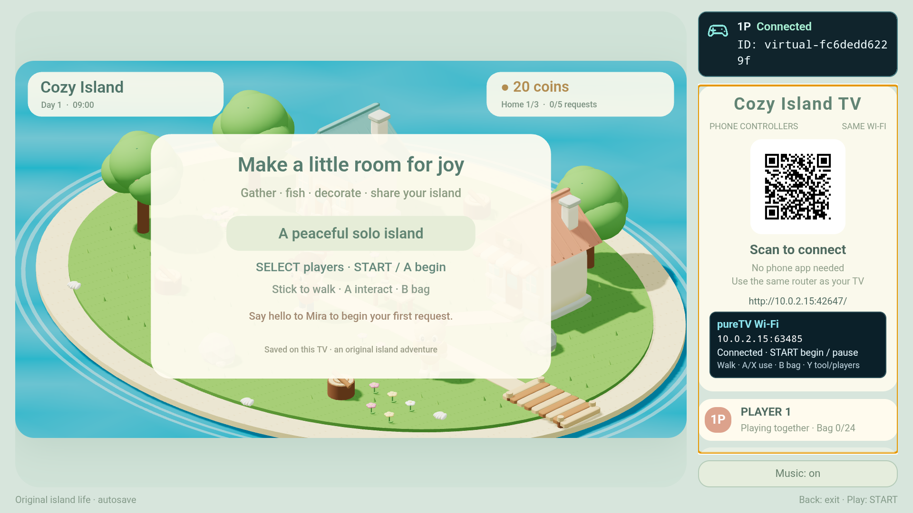
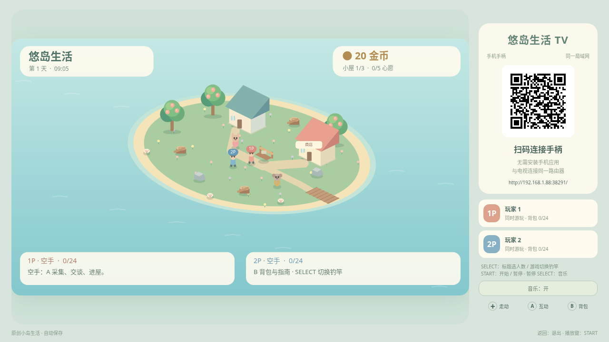
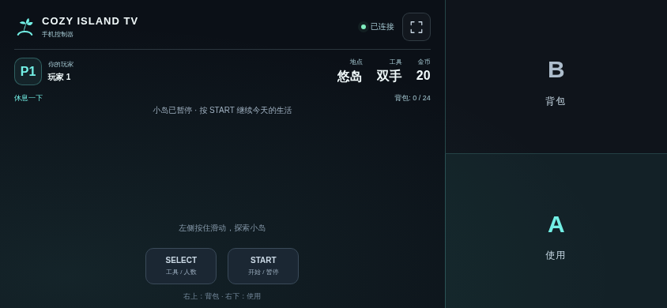
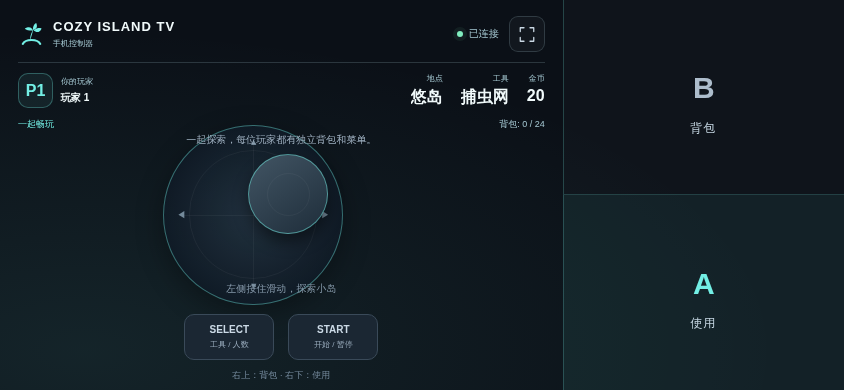

# 悠岛生活 TV

[中文](README.md) · [English](README.en.md)

<!-- controller-client-status:start -->
## 0.5.4 · 手柄连接标识

<!-- apk-resource:start -->
[下载签名 APK](cozy-island-0.5.4.apk?raw=1) · [校验值](SHA256SUMS.txt) · [签名与来源](resource.json) · [源码](src/) · [图标](logo.svg)
<!-- apk-resource:end -->

Android **0.5.4 / versionCode 6**：手柄连接后，侧边显示手柄图标、玩家席位（按游戏人数显示 1P/2P）和设备完整连接 ID；断开后隐藏。默认 TCP 端口仍为 **63485**。当前手柄固件未上报 RSSI，因此不显示信号强弱。

[连接截图](docs/releases/0.5.4/connected.png) · [连接状态专项录像](docs/releases/0.5.4/controller-status.mp4?raw=1) · [版本验证](docs/releases/0.5.4/verification.json) · [20 款更新记录](../../../docs/controller-client-status/README.md)

安装包沿用原发布证书。本轮在 Android TV 模拟器中验证连接身份、断开／重连状态及同证书覆盖安装；截图和录像记录菜单中的连接状态专项，没有重做完整玩法验收。未改规则模型按精确哈希复用历史依据，旧版报告继续保留。尚未验证实体电视、手机、ESP32 或带已有存档的升级与数据保留。


<!-- controller-client-status:end -->

一款参考岛屿生活经营玩法、独立制作的电视游戏。采用实际 WebGL 1 三维场景与跟随镜头，在原创岛屿中采集、昼夜钓鱼、记录鱼类图鉴、完成居民任务、制作和布置家具，并逐步升级小屋。

当前版本 **0.5.4**，适用于 Android 8.0 及以上电视，包名 `com.ecojust.cozyislandtv`。
<!-- visual-release:start -->
## 历史：0.5.2 视觉更新与验证

以下保留 **0.5.2** 发布时的视觉更新、源码和验收记录；这些旧版结果不代表本轮 pureTV 手柄更新已经通过验收。当时沿用 0.5.0／0.5.1 的 pureTV 发布证书。逐款改动、检查范围和实机验证状态见[0.5.2 视觉更新记录](../../../docs/game-visuals-0.5.2.md)。

该次视觉更新以《集合啦！动物森友会》（Animal Crossing: New Horizons）的三维岛屿表现为参考，用 WebGL 1 实际 3D 场景重建地形、人物、建筑与镜头。岛屿和居民由本项目独立制作，采集、钓鱼、捕虫、家具、存档和局域网双人流程保留，专项检查结果见下文。这不是商业原作的完整移植。

具体还原范围见[参考说明](docs/reference.md)。3D 渲染使用随应用本地打包的 Three.js r124（MIT），无需 CDN。

<!-- final-verification -->
当时冻结源码 0752b658aecbb1322cb7294e3176500639db1b54 已通过 Android CI 40843467072：280 项模型／渲染行为回归、36 个兼容场景、131 个手柄场景及 18 个双语集成场景；Cozy Island 输入运行时 9／9、两款 WebGL 1 渲染脚本及 Coast Kart 道具攻防专项也通过。Android 构建、lint、体积和 staging 成功，15 个模块实际执行 JUnit 任务（含全部 9 款游戏），不推断未输出的 JUnit 用例数。签名运行 40846148068 已核验九款 APK 的源码资源、签名与资源目录。Chrome 61 语法和现代 Chromium 旧 API 模拟不等于真实旧 WebView 验收；当时尚未测试真实电视／手机、设备 FPS、覆盖安装和数据保留。

该次发布前的 WebGL 1 专项已验证实际行走和镜头跟随、同屏／分屏、不同室内外位置、昼夜、建筑遮挡淡化、家具预览、初始化失败清理及绘制中上下文丢失／恢复。60 件家具和反复预览检查中，GPU 几何 67、纹理 3、保留几何 72 未持续增长。检查使用 ANGLE／SwiftShader 软件渲染；浏览器保存／重载与存档格式兼容不能代替真实 APK 覆盖安装保留存档测试。当时冻结源码 0752b65 已通过 Android CI 40843467072 的完整浏览器与原生检查。本地最后两种语言联动 2／2、输入运行时回归 9／9 通过，保留正常钓鱼窗口，并检查暂停／隐藏／失焦及手机取消手势不误捕或误写存档；这些运行是浏览器和模拟原生桥接检查。当时尚未测试真实电视帧率、实机升级存档保留和局域网操作时延。
<!-- visual-release:end -->

## 历史：0.5.1 还原度升级

加入昼夜昆虫、慢走举网与松手捕获、物种背包和共享图鉴，沿用旧存档格式；未验证带存档升级及原进度保留。

沿用 0.5.0 证书，可直接覆盖更新；0.5.1 的核对结果与剩余差距见[还原度复核](../../../docs/game-fidelity-0.5.1.md)。

## 安装与签名

历史 0.5.3 已沿用 0.5.0／0.5.1／0.5.2 的 pureTV 统一发布证书，并在 Android TV 模拟器完成 0.5.2 → 0.5.3 覆盖安装；未验证带存档升级及数据保留。使用旧证书的 0.4.x 及更早安装不能直接覆盖，请先备份可导出的数据再卸载；卸载会清除本机存档和记录，本项目没有跨证书自动迁移工具。

## 开始游玩

1. 手机和电视接入同一局域网，在电视上打开游戏。
2. 手机浏览器扫描房间二维码，每位玩家使用一部手机，无需安装手机端应用。
3. 标题画面选择人数，再按 START 开始。
4. 左侧浮动摇杆以落指位置为中心；拖动控制，松开释放。右侧屏幕三分之一整块用于动作，上半区 B、下半区 A，任意位置按下都有效，可与摇杆同时操作。START／SELECT 独立位于左侧底部；游戏操作区禁止选中文字和长按菜单。

| 控件 | 功能 |
| --- | --- |
| 浮动摇杆 | 移动角色／选择菜单项 |
| A | 交互、采集、钓鱼或确认；持捕虫网时按住慢走，松开挥网 |
| B | 打开背包／返回 |
| SELECT | 依次切换空手／钓竿／捕虫网；摆放时旋转；标题选人数；暂停时切换音乐 |
| START | 开始、暂停／继续 |

单人或两人可以同时活动。背包与交互菜单分别操作，共享岛屿建设进度；一人进入小屋时，另一人仍可继续在户外活动。五种鱼按岛上时间出现；浮标会轻轻试探，真正咬钩后及时按 A。图鉴记录每种鱼的捕获次数和最大尺寸，首次发现奖励 10 金币，存档格式保持不变，历史 0.5.3 已沿用同一证书，并在 Android TV 模拟器完成从 0.5.2 覆盖安装；未验证带存档升级及原存档保留；仅使用旧证书的 0.4.x 及更早安装需要另行备份，不能自动跨证书迁移。游戏提供有限且可完成的居民任务与小屋升级目标，具体物品、任务和范围见[游戏说明](docs/reference.md)。

岛上还生活着昼夜出没的粉蝶、甲虫和萤火虫。跑近会惊飞，举网慢走后面向昆虫松开 A 捕获；昆虫可出售并登记到共享图鉴，两人不能重复捕获同一只。

## 历史画面（0.5.2）

截图来自实际游戏页面在 Chromium 中的渲染，使用模拟房间桥接，不是电视实机截图。







## 存档、房间与退出

重要物品与建设操作会保存，角色位置定期保存。存档格式保持不变，历史 0.5.3 已沿用 0.5.0／0.5.1／0.5.2 的证书，并在 Android TV 模拟器完成 0.5.2 → 0.5.3 覆盖安装。未验证带存档升级及原存档保留。使用旧证书的 0.4.x 及更早安装不能直接覆盖，需先备份可导出的数据；没有自动跨证书迁移。卸载或确认重置存档会清除进度。

最多两部手机通过本地 HTTP/WebSocket 房间连接，每次启动产生新的端口与随机令牌。触控中断、失焦和断线会释放按键；正在参与游戏的手机断线会自动暂停，重连恢复自动暂停，手动暂停仍然保留。

按电视 Home 离开或确认退出，会关闭房间、断开手机、释放线程与唤醒锁、销毁 WebView 和音频并结束应用进程。重新打开后请扫描新的二维码。

## 开发与实现范围

地图、画面、角色与合成音乐均独立制作，不包含任天堂软件、ROM 或提取素材，也不代表 Switch 商业原作的完整内容。具体实现与差异见[参考说明](docs/reference.md)。项目自写代码和素材使用 [MIT](LICENSE)。

```sh
node --test resource/apps/cozy-island/tests/*.test.cjs
node resource/apps/cozy-island/tests/controller.mjs
node resource/apps/cozy-island/tests/compatibility.mjs
node resource/apps/cozy-island/tests/capture.mjs

cd resource/launcher/puretv
./gradlew :cozy-island:assembleRelease :cozy-island:testDebugUnitTest :cozy-island:lintDebug :cozy-island:verifyReleaseSize
```

浏览器测试使用 desktop 的 npm 依赖和 Chromium，可通过 `CHROMIUM_PATH` 指定浏览器。尚未完成电视／手机实机验证。

## pureTV Wi-Fi 手柄

电视与手柄连接同一局域网，打开游戏后按手柄 GPIO 23 搜索键。界面显示真实地址、端口和发现状态；默认 TCP 端口为 **63485**，仅首次被占用时选备用端口，临时失焦期间保持已选端口；按 Home 或切换应用退出会关闭服务。同网只运行一个游戏接收服务时才能自动选中。

START 开始、暂停或继续。方向键走动；A / X 互动；B 打开背包；Y 在标题页切换人数、游玩时切换工具、摆放时旋转，暂停时切换音乐。 手机扫码、遥控器和键盘仍可使用；此游戏的 Y 是 SELECT 功能，X 与 A 为同一动作。

断线、手柄会话替换或控制来源切换会取消旧输入并暂停。重新连接后先松开按键，再按 START 继续，保持的按键不会自动触发操作。双人模式可连接两只独立 Wi-Fi 手柄，按各游戏标题页选择人数。

<!-- controller-client-status-history:start -->
<details>
<summary>历史 0.5.3 安装包与验收记录</summary>

以下为旧版发布记录，其测试与画面不代表本次连接 ID 界面验收。[原提交中的完整说明](https://github.com/ecojust/pureTV/blob/9af9f197855eb7a0ce7174c0e6295c8974b3250d/resource/apps/cozy-island/README.md)。

[下载 APK](cozy-island-0.5.3.apk?raw=1) · [校验值](docs/controller-status-baseline/0.5.3/SHA256SUMS.txt) · [签名及构建来源](docs/controller-status-baseline/0.5.3/resource.json) · [源码](src/) · [64×64 SVG 图标](logo.svg)

APK 已使用原 pureTV 发布证书签名，已在 Android TV 模拟器完成 0.5.2 → 0.5.3 覆盖安装；未验证带存档升级及数据保留。若设备中存在使用旧证书的同包应用，Android 无法直接覆盖安装；需先备份数据并卸载旧包。

## 0.5.3 pureTV 手柄更新

历史版本 **0.5.3 / versionCode 5** 新增 pureTV Wi-Fi 手柄输入，默认 TCP 端口 **63485**，保留扫码手机手柄和电视遥控器。APK 已沿用原发布证书正式签名。Android TV 模拟器中的实际 APK 手柄验收已通过 9/9，覆盖 START、实际玩法输入、暂停恢复、断线重连和同序号 ACK。

实际结果和限制见[当时 20 款游戏验收记录](../../../docs/readme-controller-support/README.md)及[发布进度](../../../docs/readme-controller-support/rollout.json)。下文保留的旧版 CI、录像和截图均为历史依据。

该历史版本验收资源：[菜单截图](docs/releases/0.5.3/menu.png) · [实际 APK 运行录像](docs/releases/0.5.3/gameplay.mp4?raw=1) · [验证记录](docs/releases/0.5.3/verification.json)。截图和录像来自 Android TV 模拟器，未做实体电视测试。完整归档、具体检查范围与限制见验证记录。

</details>
<!-- controller-client-status-history:end -->
